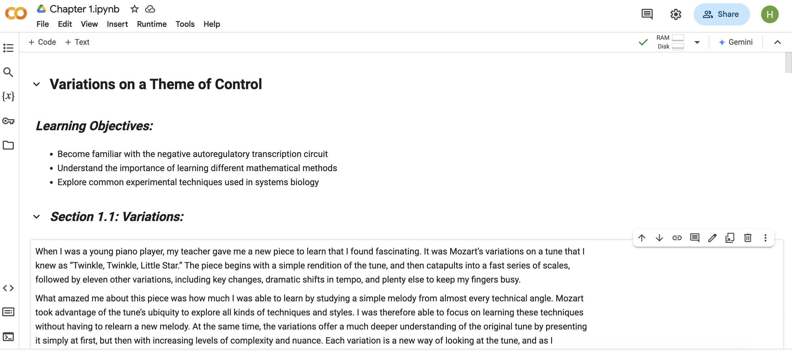

# Online Companion to Fundamentals of Systems Biology

  

## Overview
For decades, biology has been focused on decoding cellular processes one gene at a time, but it is clear that
many of the most pressing questions and diseases (e.g., cancer, heart disease, obesity) are related to the
interaction of hundreds, or even thousands, of gene products. How can we begin to understand this
complexity? Thanks to a variety of technological developments, we now have ways to assay the activity of
thousands of gene products at a time, but the methods for assimilating this data and teasing out the most
important features of a biological network are still very much in development. Systems biology is the exciting
field that has arisen to address this need, at the intersection of computational modeling and molecular biology.

## Learning Objectives
1. **Implement** fundamental approaches to modeling biological systems, including
   - boolean representations
   - analytical solutions
   - graphical analysis
   - numerical integration
   - stochastic simulations
3. **Identify** strengths and weaknesses of each approach
4. **Apply** these concepts to metabolic, signaling, and regulatory networks
5. **Integrate** different modeling techniques together into a unified model

## Setup
### Download
#### Option 1: Download individual .ipynb files
> **Note:** This is the most friendly approach for users from non-coding backgrounds. The online textbook is organized by chapters under [Notebook_by_Chapters](https://github.com/CovertLab/BIOE101-Online-Companion/tree/main/Notebook_by_Chapters) folder.

#### Option 2: Clone GitHub Repository

    git clone https://github.com/CovertLab/BIOE101-Online-Companion.git

### Access Notebooks
#### Option 1: Via Google Colab
**Step 1:** Upload .ipynb files to a Google Drive

**Step 2:** Open in Google Colab
Double-clicking on the file will direct you to Google Colab. All the figures are already rendered but feel free to run the code segments at your convenience. Enjoy!

#### Option 2: Via PyCharm
> **Note** The notebooks only render well in PyCharm and are not compatible with Visual Studio Code or Jupyter Notebook.

